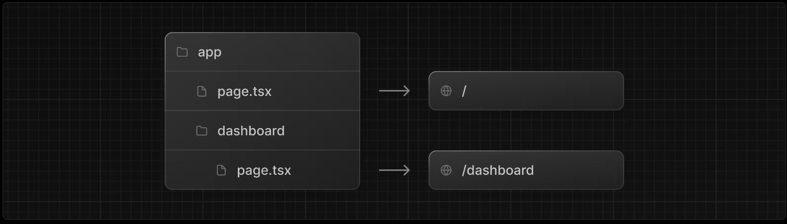
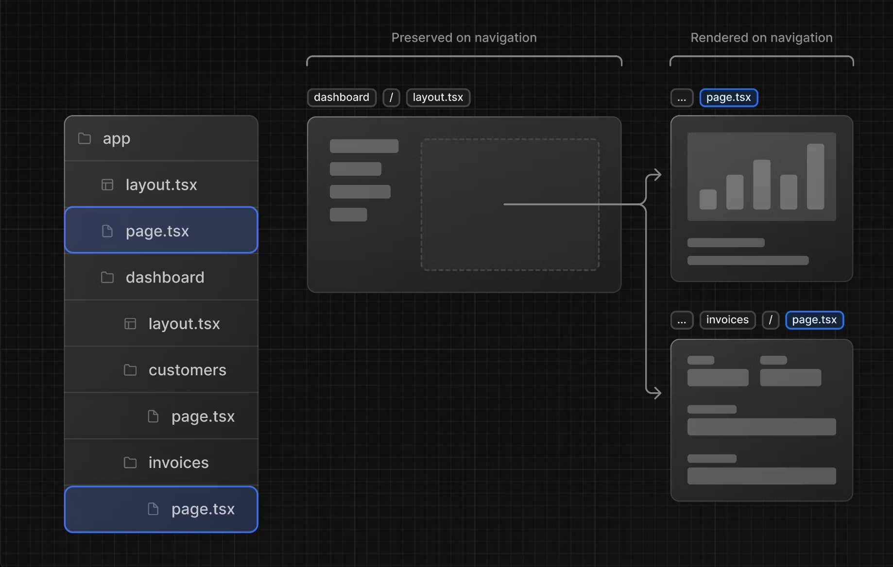

### 基础目录
- `app/`: 包括application所有业务逻辑
    - `app/lib`: 通用函数目录
    - `app/ui`: 组件、样式目录
    - `app/layout.tsx`: 根布局
    - `app/page.tsx`: 根Path
- `public`: 静态资源， 可直接在站点访问
- `scripts`: 可执行文件
- `next.config.js`: NestJs的配置文件

### 路由

- `page.tsx` 文件将作为该Path下的页面入口文件。
- `layout.tsx` 文件将作为该Path下的布局文件，比如`/dashboard/xxx`也将加载`/dashboard/Layout.tsx`

> 所用在NextJs中，普通文件可以和page/layout放在一个目录中（lib/ui也不是必须有，只是习惯如此）。
#### 页面切换
- ##### <Link />
> 用于替换<a/>, 切换页面(不会完全刷新)；
> 为了改善导航体验，Next.js会自动将你的应用程序按路段进行代码分割；
> 在生产中，NextJs会自动在后台预取<Link/>链接路由的代码,从而极大提高点击开启页面的速度；

#### 获取URL
- 使用usePathname
```tsx
'use client';
...
import { usePathname } from 'next/navigation';
...
```

### 样式
- 全局样式： 作用全局，在`app/layout.tsx`中被引入，如: `import '@/app/ui/global.css'`
- 模块样式： 作用于某个或某几个模块，`[name].module.css`命名；
    ```
        import styles from '@/app/ui/home.module.css';
        <div className={styles.shape} />;
    ```
    > 每个模块样式自动生成唯一的class名，确保模块样式之间不重名

### 哪部常用组件
- `import Image from 'next/image';`
> 默认异步加载， 优化图片大小等等问题

## Other
### 常用
- `clsx`: 
```tsx
import clsx from 'clsx';
 
export default function InvoiceStatus({ status }: { status: string }) {
  return (
    <span
      className={clsx(
        'inline-flex items-center rounded-full px-2 py-1 text-sm',
        {
          'bg-gray-100 text-gray-500': status === 'pending',
          'bg-green-500 text-white': status === 'paid',
        },
      )}
    >
    // ...
)}

```